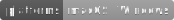

# SpaceEye

Live satellite imagery for your **Mac** or **Windows** desktop background.





## Install

### Mac

<a href="https://apps.apple.com/us/app/spaceeye-satellite-wallpaper/id1539851747?mt=12&amp;itsct=apps_box&amp;itscg=30200" style="display: inline-block; overflow: hidden; border-top-left-radius: 13px; border-top-right-radius: 13px; border-bottom-right-radius: 13px; border-bottom-left-radius: 13px; width: 250px; height: 83px;"></a>

- Download from the **Mac App Store** by clicking the link above (US and Canada
  only).
- Download from the [latest GitHub
  release](https://github.com/KYDronePilot/SpaceEye/releases/latest)
  (available everywhere):
  - [SpaceEye-1.2.1.dmg](https://github.com/KYDronePilot/SpaceEye/releases/download/v1.2.1/SpaceEye-1.2.1.dmg)
    or
  - [SpaceEye-1.2.1-mac.zip](https://github.com/KYDronePilot/SpaceEye/releases/download/v1.2.1/SpaceEye-1.2.1-mac.zip)

### Windows

<a href="//www.microsoft.com/store/apps/9NF3WZ8TT6MN?cid=storebadge&ocid=badge"></a>

- **Recommended**: Download from the **Microsoft Store** by clicking the link
  above (Microsoft account not needed; US and Canada only).
- Alternative: Follow the [installation
  instructions](https://github.com/KYDronePilot/SpaceEye/wiki/Installing-on-Windows)
  to download and run the installer from the latest GitHub release (available
  everywhere).
  - **Note**: You will have to dismiss warnings about the download being
    potentially dangerous with this method.

## About

SpaceEye is an open source desktop app which sets live, publicly available
satellite imagery as your desktop background.

New images are downloaded approximately every 10 minutes to an hour (depending
on the view), giving an up-to-date, high resolution view of the Earth from
space.

Currently, the app provides 12 views of the Earth from 5 different geostationary
weather satellites: Himawari-8, GOES-17 (West), GOES-16 (East), Meteosat-8, and
Meteosat-11. This list will hopefully be expanded in the future.

## Acknowledgements

Special thanks to [NOAA STAR](https://www.star.nesdis.noaa.gov/star/index.php)
and the [Regional and Mesoscale Meteorology Branch
(RAMMB)](http://rammb.cira.colostate.edu) of NOAA/NESDIS (located at Colorado
State University) for providing the satellite imagery.

## Issues

If you encounter a bug or have a feature request, please create an issue on the
[Issues page](https://github.com/KYDronePilot/SpaceEye/issues).

## Development

### Requirements

- NodeJS
- Yarn
- [`windows-build-tools`](https://www.npmjs.com/package/windows-build-tools) (if
  on Windows)

[VS Code](https://code.visualstudio.com) is recommended for development, but not
required. The repo includes configs and recommended extensions.

### Setup

```bash
git clone https://github.com/KYDronePilot/SpaceEye.git
cd SpaceEye
yarn
yarn run build
```

### Start in dev mode

Opens Chromium dev tools and watches renderer files.

```bash
yarn run start-dev
```

### Package the app

Builds and packages app for distribution.

If on macOS, creates DMG and ZIP files, or if on Windows, creates NSIS
executable installer.

```bash
yarn run dist
```

## Privacy

The only data collected are server logs when downloading the [satellite config
file](https://spaceeye-satellite-configs.s3.us-east-2.amazonaws.com/1.0.1/config.json).
This config file contains metadata and links to the satellite images provided by
NOAA and RAMMB.

## License

MIT © [Michael Galliers](https://github.com/KYDronePilot)
