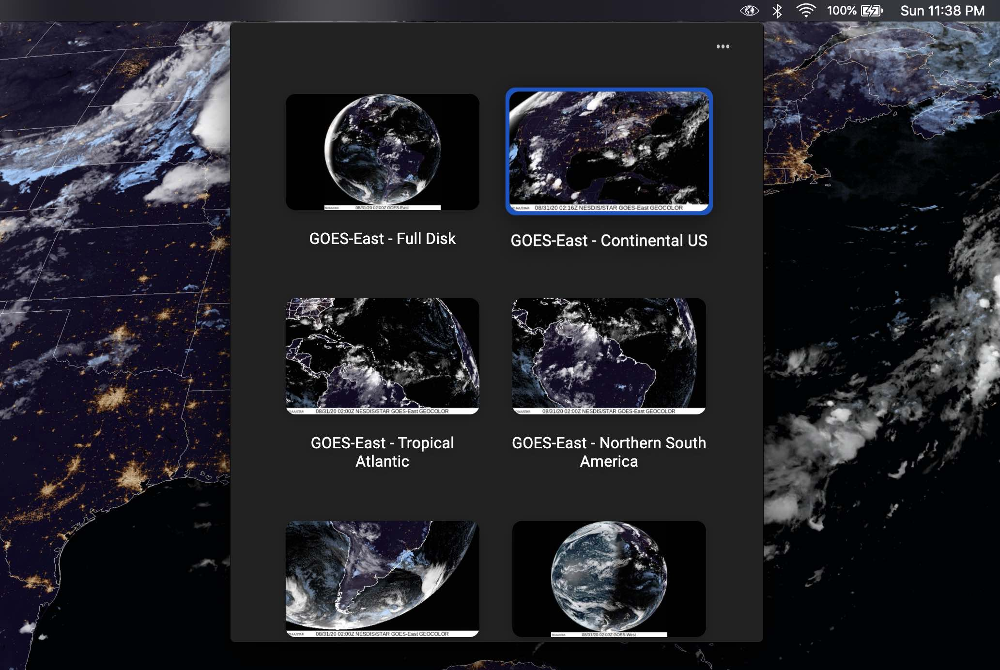

# SpaceEye

Live satellite imagery for your **Mac** or **Windows** desktop background.

## Install

### Mac

- Download from the [Mac App
  Store](https://apps.apple.com/us/app/spaceeye-satellite-wallpaper/id1539851747)
  (US and Canada only).
- Download from the [latest GitHub
  release](https://github.com/KYDronePilot/SpaceEye/releases/latest)
  (available everywhere):
  - [SpaceEye-1.1.2.dmg](https://github.com/KYDronePilot/SpaceEye/releases/download/v1.1.2/SpaceEye-1.1.2.dmg)
    or
  - [SpaceEye-1.1.2-mac.zip](https://github.com/KYDronePilot/SpaceEye/releases/download/v1.1.2/SpaceEye-1.1.2-mac.zip)

### Windows

- Follow the [installation
  instructions](https://github.com/KYDronePilot/SpaceEye/wiki/Installing-on-Windows)
  to download and run the installer from the latest GitHub release.

## About

SpaceEye is an open source desktop app which sets live, publicly available
satellite imagery as your desktop background.

New images are downloaded approximately every 20 minutes to an hour (depending
on the view), giving an up-to-date, high resolution view of the Earth from
space.

Currently, the app provides 10 views of the Earth from 3 different geostationary
weather satellites: Himawari-8, GOES-17 (West), and GOES-16 (East). This list
will hopefully be expanded in the future.

## Acknowledgements

Special thanks to [NOAA STAR](https://www.star.nesdis.noaa.gov/star/index.php)
and the [Regional and Mesoscale Meteorology Branch
(RAMMB)](http://rammb.cira.colostate.edu) of NOAA/NESDIS (located at Colorado
State University) for hosting the satellite imagery.

## Issues

If you encounter a bug or have a feature request, please create an issue on the
[Issues page](https://github.com/KYDronePilot/SpaceEye/issues).

## Privacy

The only data collected are server logs when downloading the [satellite config
file](https://spaceeye-satellite-configs.s3.us-east-2.amazonaws.com/1.0.1/config.json).
This config file contains metadata and links to the satellite images provided by
NOAA and RAMMB.

## License

MIT © [Michael Galliers](https://github.com/KYDronePilot)
